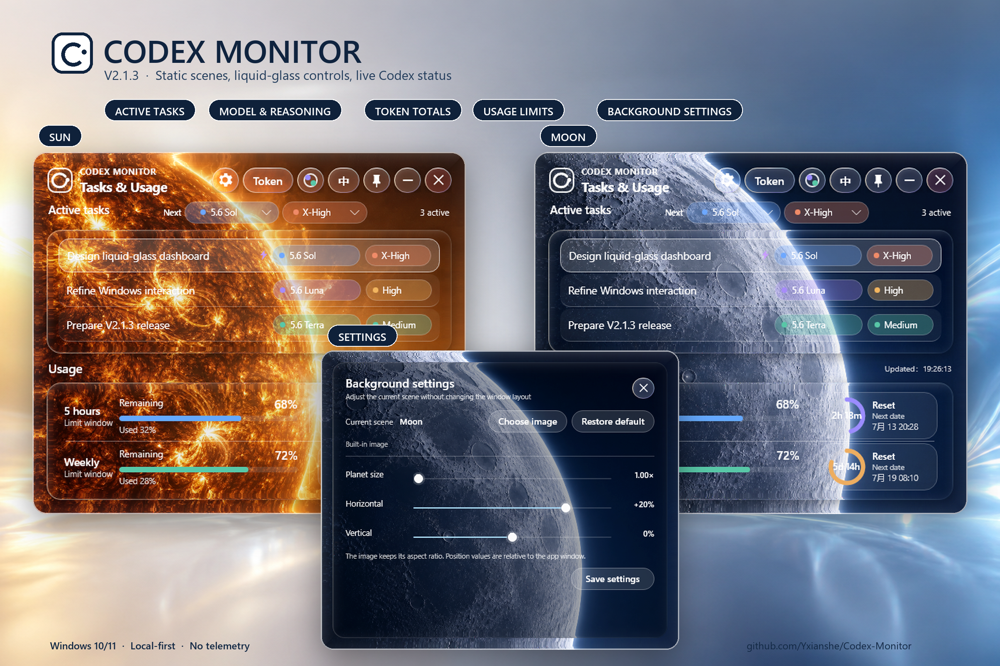

# Codex Monitor

<p align="center">
  <strong>A compact liquid-glass desktop monitor for Codex on Windows.</strong><br>
  Active tasks, real model and reasoning state, cumulative tokens, and usage limits in one local-first panel.
</p>

<p align="center">
  
  
  
  
</p>

<p align="center">
  <a href="https://github.com/Yxianshe/Codex-Monitor/releases/download/v2.1.3/Codex-Monitor-v2.1.3.exe"><strong>Download V2.1.3</strong></a>
  ·
  <a href="https://github.com/Yxianshe/Codex-Monitor/releases">All releases</a>
  ·
  <a href="#build-from-source">Build from source</a>
</p>

<p align="center">
  
</p>

## V2.1.3 at a glance

V2.1.3 is the polished **static-scene release**. It keeps the cinematic sun and moon artwork, liquid-glass controls, and live Codex information while removing the experimental animated-planet rendering path. This gives the release a quieter visual rhythm, lower background overhead, and consistent composition during dragging, resizing, integrated-GPU use, and remote desktop sessions.

- **Active task monitor** — concise task titles with the real current model and reasoning level.
- **Per-task selection** — select a task, then set the model and reasoning preference used by its next turn.
- **Priority indicator** — a purple lightning mark identifies the 1.5× priority path.
- **Cumulative tokens** — the `Token` control switches task rows between model state and token totals.
- **Usage limits** — 5-hour and weekly remaining quota, used percentage, countdown, and exact reset time.
- **Static sun and moon scenes** — automatic day/night selection plus instant manual switching.
- **Background settings** — choose an image, restore the built-in scene, and adjust zoom and position with explicit saving.
- **English / 中文** — English by default, with one-click language switching.
- **Native desktop behavior** — always-on-top, minimize, close, fast title dragging, and resizing from every edge.
- **Monochrome glass icon** — a thicker, high-contrast application mark that stays readable over either scene.

> Animated sun and moon rendering is intentionally reserved for **V2.2.0** so it can be designed and optimized as a separate rendering system.

## Liquid-glass design

The interface is built as a layered material rather than a flat blur:

1. a static high-detail scene;
2. a bounded refractive capture inside each glass surface;
3. restrained frost and tint;
4. convex depth, inner shading, and soft physical shadow;
5. a continuous highlight rim with subtle spectral dispersion;
6. crisp text and icons rendered above the distorted sampling pass.

The main cards are optically thicker than the inset controls, while dropdowns, buttons, and sliders use a lighter frosted treatment. Window corners use one native outer clip to avoid double borders, black halos, and rectangular remnants.

## Background settings

Open the gear button to configure the current sun or moon scene:

- choose a custom PNG, JPG, WebP, or BMP;
- restore the built-in image;
- adjust planet size;
- move the image horizontally or vertically without exposing an empty edge;
- save the current values as the next-launch default.

Sun and moon settings are stored separately in `%LOCALAPPDATA%\CodexMonitorV2\scene-settings.json`.

## Download and run

1. Download [`Codex-Monitor-v2.1.3.exe`](https://github.com/Yxianshe/Codex-Monitor/releases/download/v2.1.3/Codex-Monitor-v2.1.3.exe).
2. Double-click the executable. It is a self-contained Windows x64 build; no separate .NET installation is required.
3. Keep Codex Desktop signed in and use at least one task so local status data is available.

Windows SmartScreen may warn about an unsigned personal-development build. Verify that the file came from this repository before running it.

## Controls

| Control | Action |
|---|---|
| Gear | Open background settings |
| `Token` | Toggle model/reasoning details and cumulative task tokens |
| Scene button | Switch between the static sun and moon scenes |
| `中` / `EN` | Switch between English and Chinese |
| Pin | Toggle always-on-top; the icon changes with the state |
| `—` | Minimize |
| `×` | Exit |

Drag the open title area to move the window. All four edges and corners support native resizing.

## Local data and privacy

| Information | Local source |
|---|---|
| Task titles | Codex `session_index.jsonl` |
| Active state and cumulative tokens | Codex `state_5.sqlite` |
| Model, reasoning level, and detailed tokens | Local Codex rollout logs |
| Usage limits and reset time | Local Codex App Server rate-limit state |
| New-task model and reasoning defaults | Local Codex configuration, written only after selection |

Codex Monitor includes no telemetry, analytics SDK, account upload, or third-party data service. Task titles, token totals, and usage data remain on the computer.

## Build from source

Requirements: Windows 10/11, .NET 8 SDK, PowerShell 5.1 or newer.

```powershell
cd .\v2-native
.\build.ps1
```

The self-contained single-file application is written to `dist/CodexMonitorV2/CodexMonitorV2.exe`.

Main projects:

- `v2-native/CodexMonitorV2` — application UI, local data reader, settings, and Windows interaction.
- `v2-native/LiquidGlassAvaloniaUI` — reusable Skia/Avalonia liquid-glass material and lens renderer.
- `tools/build_readme_hero.py` — reproducible README product-image compositor using anonymized application captures.

## Roadmap

### V2.2.0 — dynamic scene rendering

The next rendering release will explore independently designed animated sun and moon scenes with a smooth GPU path, integrated-graphics support, remote-desktop fallback, reduced-motion behavior, and stable composition during drag and resize.

## Open-source acknowledgements

- [LiquidGlassAvaloniaUI](v2-native/LICENSE.LiquidGlassAvaloniaUI)
- SDF lens ideas informed by [Cloudy](https://github.com/skydoves/Cloudy) and [FletchMcKee/liquid](https://github.com/FletchMcKee/liquid)

## License

[MIT License](LICENSE). Contributions and derivative projects are welcome.
