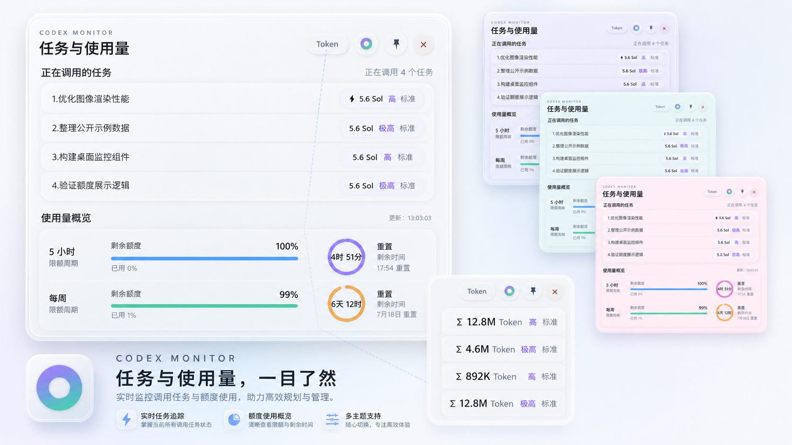

# Codex Monitor

<p align="center">
  
</p>

<p align="center">一款轻量、通透的 Windows Codex 桌面监控工具。</p>



## 功能

- 实时显示正在调用的 Codex 任务，优先读取任务标题而不是整段提示词
- 一键切换每个任务的模型信息与累计 Token
- 显示 5 小时与每周剩余额度、已用比例和重置倒计时
- Acrylic 玻璃质感、低饱和柔和渐变与多套配色
- 支持置顶、四边缩放、单实例运行和独立任务栏图标
- 本地读取 Codex 状态，不上传任务内容或使用量数据

## 使用

从 [Releases](https://github.com/Yxianshe/Codex-Monitor/releases) 下载 `CodexTaskMonitor.exe`，双击即可运行。程序需要本机已经安装并使用过 Codex 桌面端。

右上角控件依次用于：

- `Token`：在模型信息与任务累计 Token 之间切换
- 彩色圆点：切换配色
- 图钉：切换窗口置顶
- 关闭：退出程序

## 从源码构建

环境要求：Windows 10/11、Windows PowerShell 5.1、.NET Framework 4.x。

```powershell
powershell -ExecutionPolicy Bypass -File .\build.ps1
```

默认生成 `CodexTaskMonitor.exe`。`sqlite3.exe` 用于兼容读取 Codex 本地状态库。

## 数据来源

| 信息 | 本地来源 |
|---|---|
| 任务标题 | Codex `session_index.jsonl` |
| 任务状态与累计 Token | Codex `state_5.sqlite` |
| 模型与详细 Token | Codex rollout 日志 |
| 额度与重置时间 | Codex 本地缓存的速率限制状态 |

“累计 Token”表示该任务被模型处理的累计文本量，不等同于计费金额，也不等同于 5 小时或每周额度百分比；状态库可能有数秒延迟。

## 项目结构

```text
monitor.ps1              主程序
Codex任务监控.ps1         中文文件名副本
Launcher.cs              EXE 启动器
build.ps1                构建脚本
GenerateIcon.ps1         图标生成脚本
Codex.ico                应用图标
sqlite3.exe              SQLite 命令行运行时
assets/                  README 界面截图
```

## 隐私

程序只读取当前 Windows 用户目录中的 Codex 本地文件，不包含遥测、登录上传或第三方服务。任务标题和 Token 数据只在本机界面显示。

## 许可证

[MIT License](LICENSE)。欢迎二次开发与提交改进。
