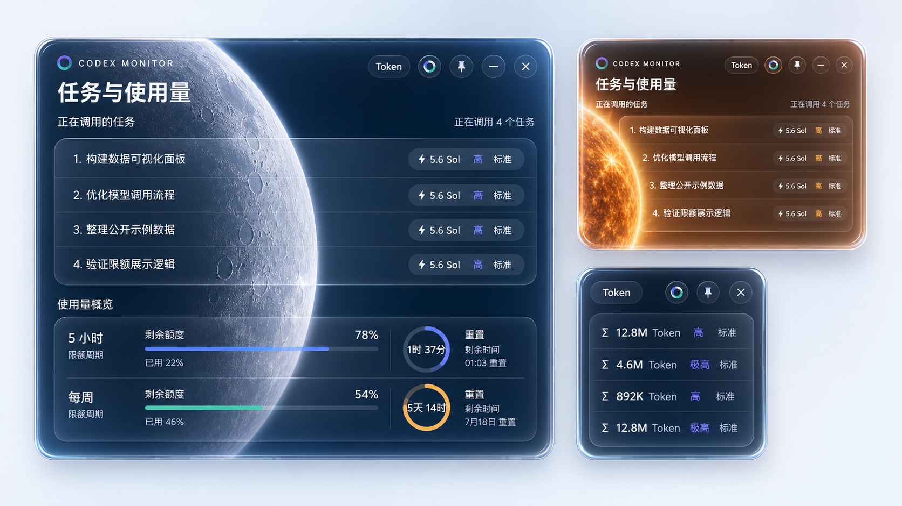

# Codex Monitor

<p align="center">
  
</p>

<p align="center">
  一款轻量、清晰的 Windows Codex 桌面监控工具。<br>
  实时查看活跃任务、累计 Token、5 小时与每周使用限额。
</p>

<p align="center">
  <a href="https://github.com/Yxianshe/Codex-Monitor/releases/latest"><strong>下载最新版</strong></a>
  ·
  <a href="https://github.com/Yxianshe/Codex-Monitor/releases/tag/v2.0.0">V2.0.0 Release</a>
</p>



## V2 特性

- **实时任务列表**：优先显示任务标题，而不是截取整段提示词。
- **模型 / Token 切换**：点击 `Token`，在模型信息和每个任务的累计 Token 之间切换。
- **限额概览**：展示 5 小时与每周剩余额度、已用比例和重置倒计时。
- **液态玻璃界面**：使用 Skia SDF 透镜、向内折射、柔和 Fresnel 边缘与低饱和染色。
- **日夜场景**：07:00–18:59 使用太阳主题，19:00–06:59 使用月球主题；右上角按钮可手动切换。
- **桌面窗口体验**：支持置顶、最小化、快速拖动，以及四边和四角缩放。
- **远程桌面兼容**：使用适合集成显卡与远程桌面的 Skia 渲染路径。
- **本地读取**：任务、Token 和限额数据只在本机读取与显示。

## 快速开始

1. 从 [Releases](https://github.com/Yxianshe/Codex-Monitor/releases) 下载 `CodexTaskMonitor-v2.0.0.exe`。
2. 双击运行，无需安装。
3. 保持 Codex 桌面端已登录并使用过至少一个任务。

> Windows 可能会对未签名的个人开发程序显示 SmartScreen 提示。请确认下载来源为本仓库后再运行。

## 顶部控件

| 控件 | 功能 |
|---|---|
| `Token` | 切换模型信息 / 任务累计 Token |
| 日月按钮 | 手动切换太阳 / 月球场景 |
| 图钉 | 切换窗口置顶 |
| `—` | 最小化 |
| `×` | 退出 |

窗口顶部空白区域可拖动；四条边与四个角均可调整大小。

## 从源码构建

环境要求：

- Windows 10 / 11
- .NET 8 SDK
- PowerShell 5.1 或更高版本

```powershell
cd .\v2-native
.\build.ps1
```

构建结果位于：

```text
dist/CodexMonitorV2/CodexMonitorV2.exe
```

## 数据来源

| 信息 | 本地来源 |
|---|---|
| 任务标题 | Codex `session_index.jsonl` |
| 活跃状态与累计 Token | Codex `state_5.sqlite` |
| 模型与详细 Token | Codex rollout 日志 |
| 限额与重置时间 | Codex 本地缓存的速率限制状态 |

“累计 Token”表示该任务被模型处理的累计文本量，不等同于计费金额，也不等同于 5 小时或每周限额百分比。状态数据可能存在数秒延迟。

## 项目结构

```text
v2-native/
├─ CodexMonitorV2/             V2 Avalonia 应用
├─ LiquidGlassAvaloniaUI/      Skia 液态玻璃渲染层
├─ build.ps1                   V2 构建脚本
└─ README.md                   V2 技术说明

assets/                        GitHub 产品图
monitor.ps1                    V1 PowerShell 版本
```

## 隐私

程序只读取当前 Windows 用户目录中的 Codex 本地文件，不包含遥测、账号上传或第三方数据服务。任务标题与 Token 数据只在本机界面显示。README 产品图使用脱敏的示例任务名称。

## 开源致谢

- [LiquidGlassAvaloniaUI](v2-native/LICENSE.LiquidGlassAvaloniaUI)
- SDF 透镜思路参考 [Cloudy](https://github.com/skydoves/Cloudy) 与 [FletchMcKee/liquid](https://github.com/FletchMcKee/liquid)

## 许可证

[MIT License](LICENSE)。欢迎二次开发与提交改进。
