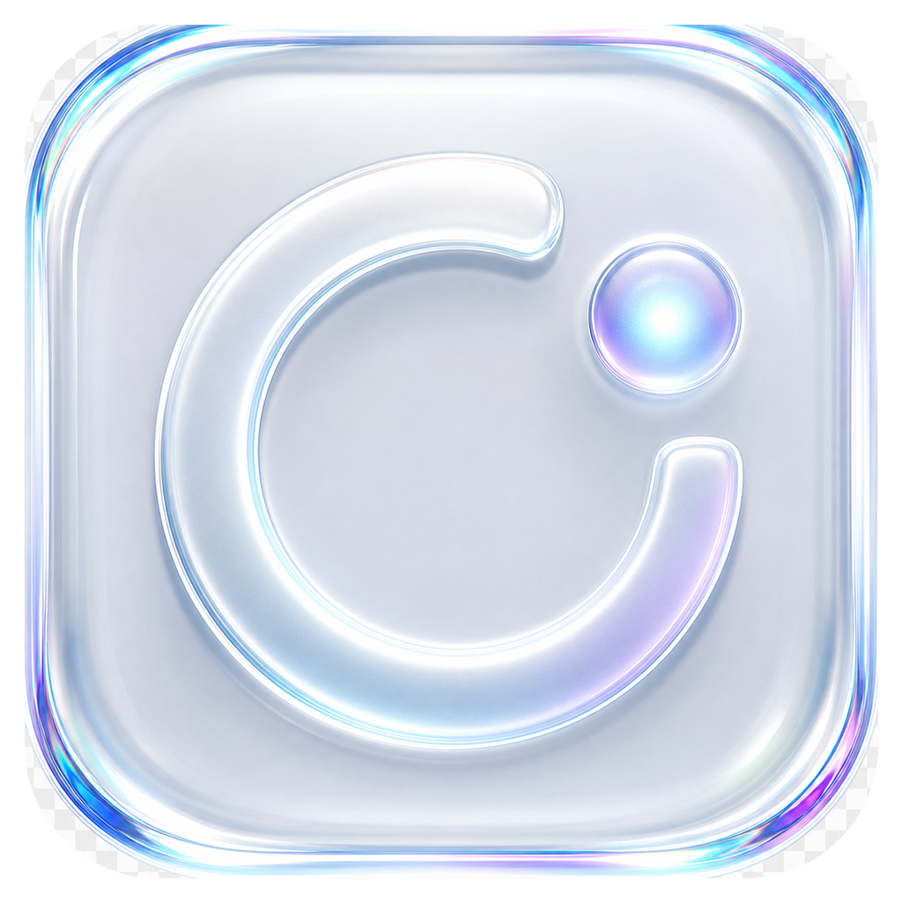
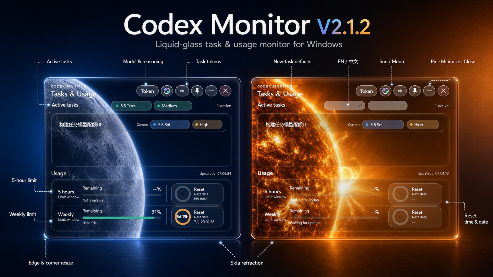

# Codex Monitor

<p align="center">
  
</p>

<p align="center">
  <strong>A liquid-glass desktop monitor for Codex on Windows.</strong><br>
  Active tasks, model and reasoning level, cumulative tokens, and 5-hour / weekly usage limits in one compact panel.
</p>

<p align="center">
  
  
  
</p>

<p align="center">
  <a href="https://github.com/Yxianshe/Codex-Monitor/releases/download/v2.1.2/CodexTaskMonitor-v2.1.2.exe"><strong>Download V2.1.2</strong></a>
  ·
  <a href="https://github.com/Yxianshe/Codex-Monitor/releases">All releases</a>
  ·
  <a href="#build-from-source">Build from source</a>
</p>

<p align="center">
  
</p>

## Highlights

- **Real active tasks** — reads local Codex task state and shows concise task titles.
- **Model and reasoning labels** — color-coded model and reasoning-strength indicators.
- **Cumulative tokens** — click `Token` to switch task rows between model status and token totals.
- **Usage limits** — 5-hour and weekly remaining quota, used percentage, countdown, and exact reset date.
- **New-task defaults** — choose the default Codex model and reasoning level for the next task.
- **English / 中文** — English is the default; the top button switches the interface language instantly.
- **Sun / moon scenes** — automatic day/night selection with a manual scene switch.
- **Desktop controls** — always-on-top, minimize, close, fast dragging, and resizing from every edge or corner.

## Liquid glass rendering

V2.1.2 uses Skia runtime shaders rather than a flat translucent panel:

- rounded SDF refraction with stronger bending near glass edges;
- subtle RGB dispersion and Fresnel highlights;
- low-amplitude turbulence and animated gradient rim light;
- dedicated moon and sun imagery beneath the glass layers;
- GPU rendering with an integrated-graphics-friendly path and remote-desktop fallback.

## Download and run

1. Download [CodexTaskMonitor-v2.1.2.exe](https://github.com/Yxianshe/Codex-Monitor/releases/download/v2.1.2/CodexTaskMonitor-v2.1.2.exe).
2. Double-click the executable. The build is self-contained; no separate .NET installation is required.
3. Keep Codex Desktop signed in and use at least one task so local status data is available.

> Windows SmartScreen may warn about an unsigned personal-development build. Verify that the file came from this repository before running it.

## Controls

| Control | Action |
|---|---|
| `Token` | Toggle model / reasoning information and cumulative task tokens |
| Scene button | Switch between the sun and moon scenes |
| `中` / `EN` | Switch between Chinese and English |
| Pin | Toggle always-on-top |
| `—` | Minimize |
| `×` | Exit |

Drag the empty title area to move the window. All four edges and corners can resize it.

> A turn that has already started cannot be safely hot-switched from another client. The model and reasoning selectors configure the next Codex task; active task rows display their real current state.

## Build from source

Requirements: Windows 10/11, .NET 8 SDK, and PowerShell 5.1 or newer.

```powershell
cd .\v2-native
.\build.ps1
```

The self-contained application is written to `dist/CodexMonitorV2/CodexMonitorV2.exe`.

## Local data sources

| Information | Local source |
|---|---|
| Task titles | Codex `session_index.jsonl` |
| Active state and cumulative tokens | Codex `state_5.sqlite` |
| Model and detailed tokens | Codex rollout logs |
| Usage limits and reset time | Local Codex App Server rate-limit state |
| New-task model / reasoning defaults | Local Codex user configuration, written only after user selection |

No telemetry, account upload, or third-party data service is included. Task titles, tokens, and usage limits remain on the local machine.

## Open-source acknowledgements

- [LiquidGlassAvaloniaUI](v2-native/LICENSE.LiquidGlassAvaloniaUI)
- SDF lens ideas informed by [Cloudy](https://github.com/skydoves/Cloudy) and [FletchMcKee/liquid](https://github.com/FletchMcKee/liquid)

## License

[MIT License](LICENSE). Contributions and derivative projects are welcome.
