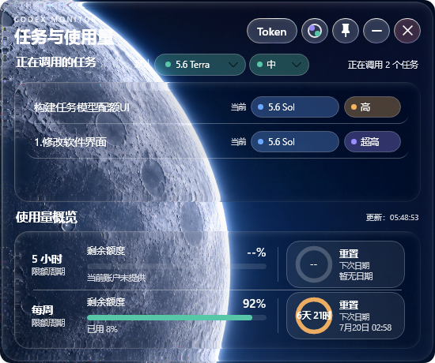

# Codex Monitor

<p align="center">
  
</p>

<p align="center">
  <strong>把 Codex 的运行状态装进一块桌面液态玻璃。</strong><br>
  实时查看活跃任务、当前模型、智能等级、累计 Token，以及 5 小时与每周限额。
</p>

<p align="center">
  
  
  
</p>

<p align="center">
  <a href="https://github.com/Yxianshe/Codex-Monitor/releases/download/v2.1.1/CodexTaskMonitor-v2.1.1.exe"><strong>下载 V2.1.1</strong></a>
  ·
  <a href="https://github.com/Yxianshe/Codex-Monitor/releases">全部版本</a>
  ·
  <a href="#从源码构建">从源码构建</a>
</p>

<p align="center">
  
</p>

## 一眼看到 Codex 正在做什么

- **活跃任务**：只显示任务标题，快速确认当前有哪些任务正在运行。
- **模型与智能等级**：以彩色色标展示每个任务真实使用的模型与推理强度。
- **累计 Token**：点击 `Token`，在模型状态与每个任务的累计 Token 之间切换。
- **限额与重置**：同时展示 5 小时、每周剩余额度、已用比例、重置倒计时和准确日期。
- **新任务默认值**：直接选择 Codex 新任务默认模型和智能等级。

## V2.1.1：真实折射的液态玻璃

- Skia Runtime Shader 实现圆角 SDF 折射，不只是普通背景模糊。
- 边缘 RGB 色散、柔和 Fresnel 高光、低振幅 turbulence 与循环珠光描边。
- 日间太阳 / 夜间月球场景，右上角可随时手动切换。
- 轻微圆角、清晰分隔线与更协调的模型标签间距。
- 支持置顶、最小化、快速拖动，以及四边和四角缩放。
- ANGLE / 集成显卡优先，并保留远程桌面的软件渲染回退。
- 本地优先：无遥测、无第三方上传，仅主动修改默认模型时写入本机 Codex 配置。

## 下载与使用

1. 下载 [CodexTaskMonitor-v2.1.1.exe](https://github.com/Yxianshe/Codex-Monitor/releases/download/v2.1.1/CodexTaskMonitor-v2.1.1.exe)。
2. 双击运行，无需安装 .NET 或额外依赖。
3. 保持 Codex 桌面端已登录并使用过至少一个任务。

> Windows 可能会对未签名的个人开发程序显示 SmartScreen 提示。请确认下载来源为本仓库后再运行。

## 控件说明

| 控件 | 功能 |
|---|---|
| `Token` | 切换当前模型色标 / 任务累计 Token |
| 日月按钮 | 手动切换太阳 / 月球场景 |
| 图钉 | 切换窗口置顶 |
| `—` | 最小化 |
| `×` | 退出 |

窗口顶部空白区域可拖动；四条边与四个角均可调整大小。

> 已经开始推理的当前回合不能从另一个客户端安全热切换模型。任务行因此只读显示真实状态；顶部“默认”选择器用于设置 Codex 新任务的默认模型与智能等级。

## 从源码构建

环境要求：

- Windows 10 / 11
- .NET 8 SDK
- PowerShell 5.1 或更高版本

```powershell
cd .\v2-native
.\build.ps1
```

构建结果位于：

```text
dist/CodexMonitorV2/CodexMonitorV2.exe
```

## 数据来源

| 信息 | 本地来源 |
|---|---|
| 任务标题 | Codex `session_index.jsonl` |
| 活跃状态与累计 Token | Codex `state_5.sqlite` |
| 模型与详细 Token | Codex rollout 日志 |
| 限额与重置时间 | Codex 本地 App Server 的速率限制状态 |
| 新任务默认模型 / 智能等级 | Codex 本机用户配置（仅在用户主动选择时写入） |

“累计 Token”表示该任务被模型处理的累计文本量，不等同于计费金额，也不等同于 5 小时或每周限额百分比。状态数据可能存在数秒延迟。

## 项目结构

```text
v2-native/
├─ CodexMonitorV2/             V2 Avalonia 应用
├─ LiquidGlassAvaloniaUI/      Skia 液态玻璃渲染层
├─ ShaderSmoke/                Shader 与 Codex 模型目录冒烟检查
├─ build.ps1                   V2 构建脚本
└─ README.md                   V2 技术说明

assets/                        GitHub 产品图
monitor.ps1                    V1 PowerShell 版本
```

## 隐私

程序不包含遥测、账号上传或第三方数据服务。任务标题、Token 与限额数据只在本机界面显示；仅“新任务默认”控件会在用户操作后更新本机 Codex 配置。README 产品图使用脱敏的示例任务名称。

## 开源致谢

- [LiquidGlassAvaloniaUI](v2-native/LICENSE.LiquidGlassAvaloniaUI)
- SDF 透镜思路参考 [Cloudy](https://github.com/skydoves/Cloudy) 与 [FletchMcKee/liquid](https://github.com/FletchMcKee/liquid)

## 许可证

[MIT License](LICENSE)。欢迎二次开发与提交改进。
